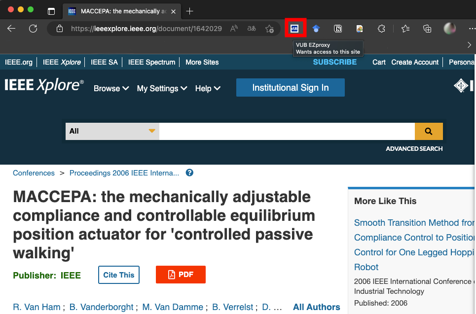

# VUB-EZProxy-Redirect
The VUB-EZProxy-Redirect automatically redirects academic links to the [VUB library's MyEZProxy login page](https://myezproxy.vub.ac.be), providing easy access to subscribed academic journals and databases from anywhere, without having to manually go to the VUB library website or typing myezproxy in the address bar.

# Installation Instructions

1. Click on the "Code" button and select "Download ZIP" to download the extension's folder.
2. Extract the contents of the downloaded ZIP file to a folder on your computer.
3. Open Microsoft Edge or Google Chrome and type "chrome://extensions" in the address bar.
4. Enable "Developer mode".
5. Click the "Load unpacked" button.
6. Navigate to the folder where you extracted the extension's folder and select the folder.
7. The extension icon will appear on your browser's toolbar.

# Usage Instructions

1. Navigate to an academic article or database that requires a VUB library subscription.
2. Click on the VUB EZProxy Redirect extension icon on the browser's toolbar.
3. The current URL of the active tab will be redirected to the VUB library's MyEZProxy login page with the appropriate login credentials.
4. Log in with your VUB library account credentials.
5. You will be automatically redirected to the original academic resource with full-text access.

# Notes

1. The instructions from [VUB's remote access](https://biblio.vub.ac.be/vlink/HELP/vlinkezproxy_en.htm) were used to make this extension.
2. The VUB EZProxy Redirect extension only redirects to the VUB Exproxy website and does not store personal data. 
3. I got help from ChatGPT in creating this extension.